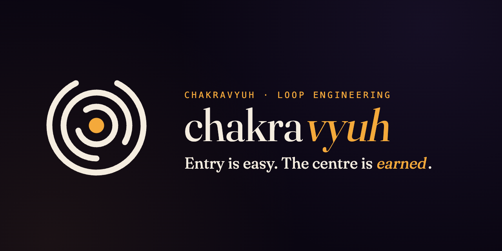
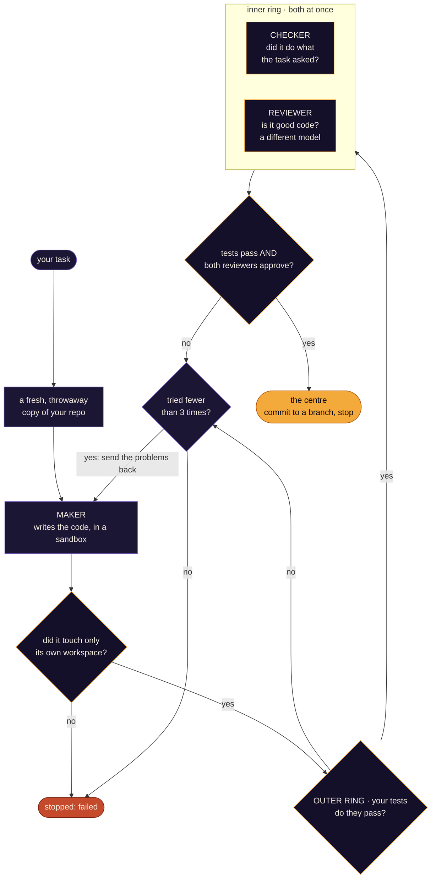
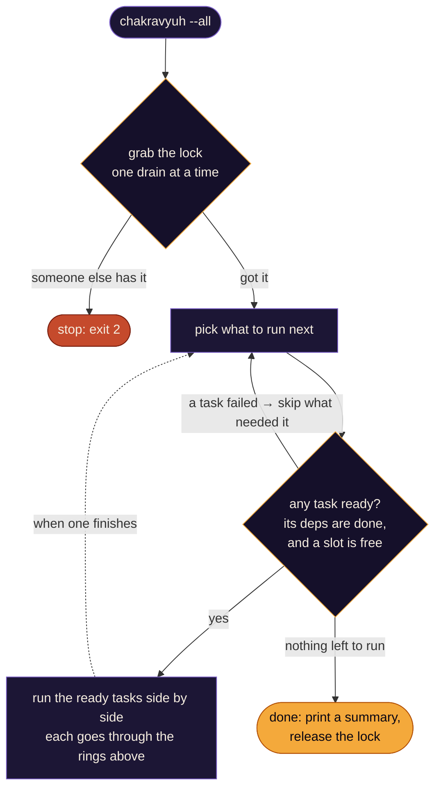

<div align="center">

<a href="https://maahaa-dev.github.io/chakravyuh/"></a>

**चक्रव्यूह** · *chakra* (wheel) + *vyūha* (formation) · a [maahaa.dev](https://maahaa.dev) loop-engineering project

*The formation your code has to earn its way through.*

</div>

---

Abhimanyu learned the *chakravyūha* from inside the womb: how to break into the spinning ring
formation, one layer at a time. The lesson stopped before the part about getting out. He could enter.
He couldn't leave.

That's every AI coding agent. It knows enough to *begin* — write plausible code, break the outer ring
— but not always enough to *finish*. It stops paying attention and ships something that compiles,
passes lint, and is still wrong. Half-knowledge walks it to the centre and leaves it there.

The tempting fix is a framework that runs the whole process for you — Spec-Kit, GSD, BMAD. But as
[Matt Pocock](https://github.com/mattpocock/skills) argues, and it's the thinking behind this project,
that just trades one trap for another: you're handed a formation someone else designed, and when the
process misbehaves, the bug lives inside their abstraction, not your code. Easy to enter. Hard to leave.

**Chakravyuh takes the other path: own the loop, and make the agent finish.** You hand it one task. A
change enters easily, but it only reaches the centre — merged — by breaking through every ring: your
tests, then a checker, then an independent reviewer. Each ring refuses half-finished work and sends it
back. "It compiles" never gets to stand in for "it's done."

Chakravyuh runs the coding agent so you don't have to sit and watch it. You write down a task. It
hands that task to a [Pi](#what-is-pi) coding agent and walks it through three jobs: a **maker** writes
the code, then a **checker** and a **reviewer** read it back and each vote on whether it's good enough.
Your own test command has the final say. When something fails, Chakravyuh collects the complaints,
hands them back, and lets the maker try again (up to three times). Once everything passes, it commits
the work to a git branch and stops. It never merges for you.

Think of it as a harness, not a chatbot. The idea is to be strict where you can and careful where you
can't. Your tests decide pass or fail, and no LLM opinion overrides that. The agent itself gets a
short leash: every run is capped on attempts, wall-clock time, and tokens, since Pi has no budget of
its own. And it all runs inside a throwaway git worktree with the shell sandboxed, so a bad run can't
reach anything it shouldn't.

> **Lineage.** Chakravyuh is *loop engineering* — owning your agent loop instead of renting someone
> else's. It began as a way to drop the Claude Code dependency and run the loop ourselves. The first
> version was a bare skeleton; since then it has **built 15 of its own features by running itself on
> itself** (see [Status](#status)). TypeScript, no framework.

---

## What it does



Your test command (the **health gate**) is the boss here. It runs before either reviewer gets a
vote, and if it fails, neither reviewer even starts, so you don't burn tokens reviewing code that
doesn't build. Every run is logged to SQLite, and a plain-text `current.md` status file is rewritten
each time so you can glance at what happened.

### What is Pi?

Pi is a headless coding agent — a sibling project living at `../pi`, outside this repo. Chakravyuh
starts it as a subprocess (`pi --mode json --print -a --tools ... --model ...`), once per role, per
attempt. Chakravyuh never touches your code itself. It runs Pi and judges the result.

---

## Why it looks like this

- **Your tests are the boss.** The checker and reviewer are LLMs, so they can be wrong. Your health
  command isn't. It's a plain exit code, and it runs before any model vote counts. No green tests,
  no approval.
- **The maker can't grade its own work.** This is enforced by tools, not by trust. The maker gets
  `edit,write`; the checker and reviewer only get read-only tools (`read,grep,find,ls`), so a
  reviewer physically cannot change the code it's judging. The reviewer also runs on a different
  model (ideally a different provider) than the maker, so it's a genuinely independent second look.
- **The limits come from outside.** Cost numbers can be unreliable or missing depending on how your
  provider reports usage, so the loop bounds itself on attempts, an idle timeout, a hard timeout, and
  a token cap, never on dollars. Pi has no limits of its own, so Chakravyuh supplies them.
- **A missing verdict counts as "no".** If a reviewer's verdict is missing or unparseable, that's a
  rejection, not a quiet pass. Silence is never taken as approval.
- **Isolation in layers.** Each attempt runs in its own git worktree. After the maker finishes, the
  real repo has to be clean; a *leak guard* fails the task if the maker wrote anywhere outside its
  worktree. On top of that, the maker's shell is boxed in by a sandbox (see [Security](#security)).

---

## Quick start

### Tier 1 — try it in 60 seconds (standalone)

No Pi, no network, no database needed. This proves the harness builds and its logic is sound —
the test suite mocks the Pi subprocess.

```bash
git clone <this-repo> chakravyuh && cd chakravyuh
npm install
npm run build      # tsc — must be clean
npm test           # 167 unit tests, Pi fully mocked (the real-Pi integration test is opt-in — off by default)
```

### Tier 2 — a real run (drives Pi for real)

This is the actual job, and it needs more than this repo.

**Prerequisites:**

- The **Pi fork built** at the sibling path `../pi` (external, gitignored — not part of this repo).
  You point at its CLI with `piBinPath` in the config below.
- **Pi configured with your model provider's credentials** — see Pi's own documentation for auth
  setup. Chakravyuh bundles no provider extensions; add any you need via `config.extensions`.
- macOS for the sandbox (Linux runs *unconfined* — see [Security](#security)).

**1. Write a config** (`config.json`, validated by Zod — see `src/config.ts`):

```json
{
  "project": {
    "id": "myproj", "root": "/abs/repo", "worktreeBase": "/abs/repo/../.wt",
    "baseBranch": "main", "healthCmd": "bash health.sh", "sandbox": true
  },
  "roles": {
    "maker":    { "provider": "anthropic", "model": "sonnet", "thinking": "medium" },
    "checker":  { "provider": "anthropic", "model": "haiku",  "thinking": "low" },
    "reviewer": { "provider": "openai",    "model": "gpt-5",  "thinking": "low" }
  },
  "backlogPath": "/abs/loops/myproj/backlog.md",
  "dbPath": "/abs/loops/myproj/chakravyuh.db",
  "currentMdPath": "/abs/loops/myproj/current.md",
  "piBinPath": "../pi/packages/coding-agent/dist/cli.js"
}
```

> **Control files live OUTSIDE the target repo** (e.g. `loops/<project>/`). If `backlogPath`,
> `dbPath`, or `currentMdPath` sit inside `project.root`, the leak guard will see them as dirty
> files and trip.

**2. Write a backlog** — one work unit per `## <slug>` heading. `title:` is optional; the rest of
the body is the spec handed to the maker:

```markdown
## fix-add
title: Fix add to return a+b
src/add.mjs returns 0. Make it return a + b so the test passes. Keep it minimal.
```

**3. Run it:**

```bash
npm run build
node dist/cli.js config.json --unit fix-add   # one unit (omit --unit to take the first)
node dist/cli.js config.json --all            # drain every non-terminal unit (concurrent; see below)
node dist/cli.js config.json --list           # print backlog units, don't run
node dist/cli.js config.json status           # one-shot live state from the store
node dist/cli.js sync-status <featureDir> config.json   # post-verify: flip issue Status: from DB outcomes
```

It exits 0 when the unit reaches `approved` (committed on branch `chakravyuh/fix-add`, waiting for
you to merge). `chakravyuh status` (or `watch -n2 … status`) shows live progress.

> **`--all` is a rolling parallel drain.** Independent units (no `Blocked by:`/`deps:` edge between
> them) run concurrently up to `project.maxParallel` (default 2; set it in the config). Units still
> run *after* everything they depend on, and a unit whose dependency failed is skipped as `blocked`.
> A cross-process lease (`drain_lock` in the store) means a second `--all` on the same store exits 2
> rather than double-draining. Set `maxParallel: 1` for the old strictly-sequential behavior.
>
> **Ctrl-C during `--all` is graceful, not immediate.** SIGINT/SIGTERM stops *starting* new units and
> lets in-flight ones self-halt to `blocked` at their next checkpoint (worktrees preserved, resumable)
> — it does **not** kill a running maker mid-work. A truly stuck run needs SIGKILL; the drain lease
> then self-heals after its 90s TTL.

> **Run it via `node dist/cli.js …`** (or a stable **runner** build, see below, or a shell alias).
> The package isn't published to npm yet, so don't expect `npx chakravyuh` to find it.

---

## How it works (one attempt, in detail)

1. **Worktree** — `addWorktree()` creates an isolated checkout on branch `chakravyuh/<slug>` from
   `baseBranch`.
2. **Maker** — Pi runs with `--tools read,bash,edit,write`, sandbox-confined, told to work
   TDD-first against the spec.
3. **Leak guard** — `project.root` must be clean afterward; if the maker wrote outside its
   worktree, the unit fails immediately.
4. **Health gate (authoritative)** — `healthCmd` runs against the worktree (bounded by the hard
   timeout). Non-zero exit ends the attempt before any model gets a vote; its captured output feeds
   the retry feedback.
5. **Checker ∥ Reviewer** — only once the gate passes, both run **concurrently** as two separate Pi
   processes (`Promise.all`): the checker (Spec axis) and the reviewer (Standards axis, ideally a
   different model/provider), each read-only, each returning its own fail-closed JSON verdict.
6. **Resolve** — gate passes AND both verdicts pass → `commitAll()`, status `approved`, stop. Any
   fail → `renderBlockers()` merges every failing verdict's blockers (axis-labeled) into the next
   attempt's prompt; retry while `attempt < maxAttempts` (≤3).
7. **Record** — every Pi run is appended to the SQLite `runs` table; `current.md` is regenerated as a
   stack of decision-ready **Briefs** (`briefFor`), not a raw run log.


### Draining a backlog concurrently (`--all`)

`--all` runs the attempt-loop above for many units at once. It's a **rolling scheduler** (not
fixed "waves"): the moment a slot frees, the next unit whose dependencies are all satisfied starts —
bounded by `maxParallel` (default 2). A single-writer **drain lease** (`drain_lock` row, atomic CAS,
heartbeat + TTL) stops two `--all` runs from double-draining the same store.



Ordering follows the dependency edges declared in each spec's `Blocked by:`/`deps:` line — units
with no edge between them run together, a unit runs only after everything it depends on, and a unit
whose dependency **failed** is skipped as `blocked` (transitively). `maxParallel: 1` reproduces the
old strictly-sequential drain exactly. Peak load ≈ `2 × maxParallel` live Pi processes (each unit
peaks at the checker ∥ reviewer pair), so raise the cap only as the host's rate limits allow.

---

## Security

The maker runs `-a` (auto-approve tools) so it can work headless — which means its `bash` is
unsupervised. So it's confined by a **macOS Seatbelt write-allowlist** (`sandbox.sb` +
`src/sandbox.ts`):

- **Writes** allowed only to: the worktree, `~/.pi`, `$TMPDIR`, the git common dir, and caches.
- **Reads / network / exec** stay open (the agent needs them to work).
- `~/.ssh` and `~/.aws` are **read-denied**.

Controlled by `config.project.sandbox` (default `true`). **macOS only** — on **Linux the maker
runs unconfined** (a bubblewrap branch is TODO). Apple Container is a future max-isolation tier.

File isolation (the worktree + leak guard) and exec isolation (the sandbox) are separate layers —
you need both, because a clean worktree doesn't stop a rogue `bash` command.

---

## Status

This is early, but it works. The core loop runs end-to-end against real model providers through Pi.

Here's the part I find genuinely fun: **Chakravyuh now builds most of its own features by running
itself on itself.** A human writes the spec, and the loop writes the code, reviews it, and lands it
on a branch. Fifteen features have gone in this way so far, with 167 tests passing.

Some of what the loop has built for itself:

- **Draining a whole backlog** (`--all`): it runs tasks in dependency order, and independent tasks
  now run in parallel, with a cross-process lock so two drains can't step on each other.
- **Two independent reviewers at once** — one checks the work against the spec, the other against
  code-quality standards (Martin Fowler's list of code smells).
- **A live log tail** (`tail -f`) so you can watch the agent work as it happens.
- Smaller conveniences: a read-only view of the backlog, a `status` command, automatic write-back of
  task outcomes to your tracker, and a readable summary file.

It has even fixed a few of its own rough edges: a tricky internal refactor, and a round of hardening
around how the test gate and the reviewer verdicts get parsed.

The workflow it's built for: a human breaks the work down and sharpens each task (I lean on Matt
Pocock's planning skills for that), then Chakravyuh drains the ready queue. For the design principles
behind the loop, see `CONSTITUTION.md`.

**Not there yet:** a self-improving "reflection" pass, deploy automation, running several projects at
once, and a Linux sandbox. Right now the sandbox is macOS only.

### Running on a stable build (self-hosting)

When you point Chakravyuh at its own repo, drive the loop from a **separate pinned build** rather than
your live checkout, so dev-side churn never dirties the target. Keep the control files (backlog, db,
`current.md`) in a directory *outside* the target repo, and rebuild the pinned copy after each merge.

---

## Project layout & further reading

| Path | What's there |
|------|--------------|
| `src/` | The harness. Start at `domain.ts` → `loop.ts` → `briefs.ts` → `cli.ts`. |
| `tests/` | 167 unit tests (mocked Pi) + a real-Pi integration test (`loop.int.test.ts`). |
| `sandbox.sb` | The Seatbelt profile. |

### Tests

```bash
npm test                                  # unit suite (mocked Pi), 167 tests — offline, no creds
# Real Pi end-to-end (opt-in: needs the built ../pi fork, network, and provider creds; spends tokens).
# Defaults to an Anthropic setup; override the provider/models via env for any Pi-supported provider:
RUN_PI_INTEGRATION=1 npx vitest --run tests/loop.int.test.ts
RUN_PI_INTEGRATION=1 PI_IT_PROVIDER=openrouter \
  PI_IT_MAKER_MODEL=anthropic/claude-haiku-4.5 PI_IT_VERIFIER_MODEL=openai/gpt-4o-mini \
  npx vitest --run tests/loop.int.test.ts
```

The integration test is the acceptance gate: a seeded failing test → real maker fixes it → gate
green → commit on `chakravyuh/fix-add`.

---

<div align="center">

**Chakravyuh** · a [maahaa.dev](https://maahaa.dev) loop-engineering project · [Apache-2.0](./LICENSE)

*creative dissolution — refactor the old, manifest the new*

</div>
